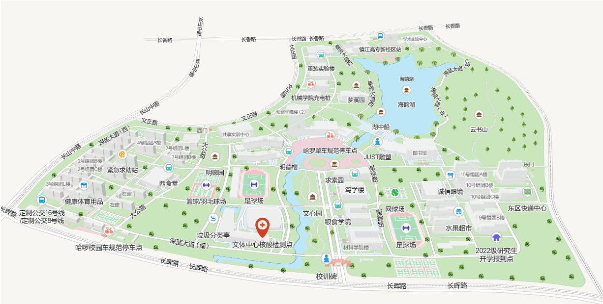

**根据题目要求：**

（1）赛事信息管理：team.txt中读取参赛队伍的基本信息，设计合适的数据结构存储，能实现对参赛队伍的增加、修改和浏览。为参赛队伍分配一个分数为60~100之间的初赛成绩，并能实现参赛队伍的成绩查询（实现基于二叉排序树的查找）。设计合适的输入输出，根据提示输入参赛队编号，查询队伍的初赛成绩，若查找成功，输出该赛事类别对应的基本信息（参赛作品名称、参赛学校、赛事类别、参赛者和初赛成绩信息）。另外，输出全部参赛队的平均查找长度ASL。

（2）决赛现场模拟：首先进行决赛分组，生成决赛秩序册，供参赛队查询。根据赛事类别将参赛队伍分配到17个决赛室（编号为1~17）。秩序册中每个决赛室的进场顺序为初赛成绩降序排列。（排序算法从选择排序、插入排序、希尔排序、归并排序、堆排序中选择一种，并为选择该算法的原因做出说明）然后，模拟决赛秩序。比赛现场会设置大型候赛区，场地中有大屏以时间线动态展示各决赛室中正在决赛的队伍，侯赛的队伍及比赛结束的队伍信息。请编写程序模拟候赛区大屏上动态展示各参赛队候场、比赛中、比赛结束的状态。

（3）决赛地图导览：为参赛者提供决赛主办地的各种路径导航的查询服务，以我校长山校区提供比赛场地为例，为参赛者提供不少于12个目标地的导航。为参赛者提供校园地图中任意目标地（建筑物）相关信息的查询；提供图中任意目标地（建筑物）的问路查询。

不难发现 需要实现功能有：

---

从team.txt中读取参赛队伍基本信息

对参赛队伍的增加、修改和浏览

根据提示输入参赛队编号查询队伍的初赛成绩，如果查询成功，输出对应的基本信息

-----

根据赛事类别将参赛队伍分配到17个决赛室，每个决赛室成绩按降序排列，设置大型候赛区，以时间线动态展示各决赛室中正在决赛的队伍，侯赛的队伍及比赛结束的队伍信息。

------

地图导航功能：

求两点之间最短路径

----

初步拟定系统界面：

------------赛事信息管理系统------------

1.修改参赛队伍信息

2.增加参赛队伍

3.浏览参赛队伍

4.查询参赛队伍成绩

5.进入决赛现场模拟

6.地图导航

<-------输入功能前数字，回车-------->

----

1.修改参赛队伍信息：

请输入需要修改的参赛队伍编号：

（返回参赛队伍的信息）

请输入需要修改的字段：

请输入修改后的值：

（返回修改后的参赛队伍信息）

---

2.增加参赛队伍：

请输入需要增加的队伍信息：

参赛队编号：

参赛作品名称：

参赛学校： 

赛事类别：

参赛者：

指导教师：

（随机给该队伍赋初赛分）

（返回增加的队伍信息）

----

3.浏览参赛队伍：

（遍历输出参赛队伍信息）

-----

4.查询参赛队伍成绩：

请输入参赛队伍编号：

（返回该参赛队伍初赛成绩）

----

5.进入决赛现场模拟：

首先，需要对决赛室进行编号，并将每个参赛队伍根据其FinalsRoom的值放入对应的容器中。 
然后，对每个容器中的参赛队伍按照初赛成绩降序排列。最后，根据用户输入的决赛室编号，显示该决赛室中每只队伍的teamNumber、school、participant以及初赛成绩。

**使用了C++标准库中的sort函数，它默认使用的是快速排序**

界面如下：
<-----决赛现场模拟----->
1.决赛室队伍查询
2.模拟决赛秩序

<---------------------->

其中决赛队伍查询的主要实现借助于map和vector

1. **生成决赛秩序册 (`generateFinalsOrder` 函数)：**
   
   - 使用一个 `map` 容器，其中键为决赛室的编号 (`FinalsRoom`)，值为一个存储参赛队伍的 `vector` 容器。
   - 通过递归遍历二叉排序树，将每个参赛队伍按照其 `FinalsRoom` 放入对应的容器中。
   - 最后，对每个容器中的队伍按照初赛成绩降序排列。

2. **显示指定决赛室中每只队伍的信息 (`displayFinalsRoomInfo` 函数)：**
   
   - 用户输入所要查询的决赛室编号 (`finalsRoomNumber`)。
   - 通过查找 `finalsOrder` 中对应编号的容器，显示该决赛室中每只队伍的 `teamNumber`、`school`、`participant`、`初赛成绩` 信息。

**模拟侯赛区**   界面

决赛室--正在决赛队伍--侯赛队伍--已结束队伍

1

2

.

.

17

每隔1秒模拟侯赛区更新一次，即每个决赛室的初赛成绩的降序进入决赛室，已结束的队伍为上一支队伍，如果当前决赛室没有已结束队伍则显示None，同理如果没有正在决赛队伍也显示None，没有侯赛队伍也显示None。

-----

6.地图导航：

请输入起点：

请输入终点：

（返回最短路径和最短路径长度）

（使用邻接矩阵存储点和点之间的路径长度）

采用深度优先搜索算法 返回路径点和最短路径。
