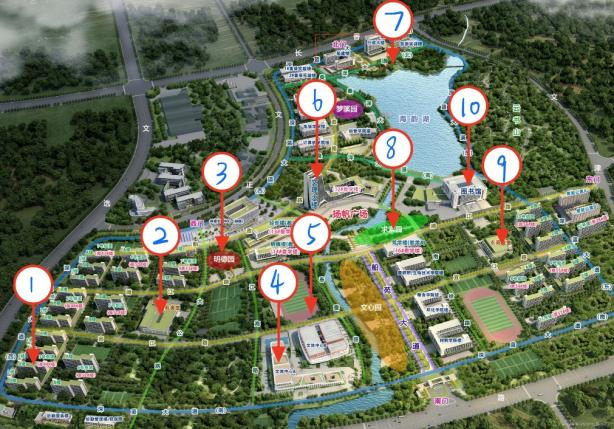
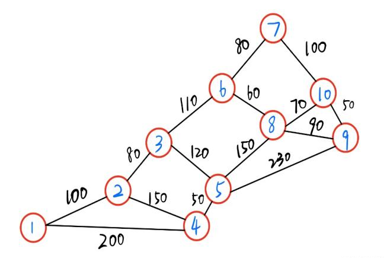
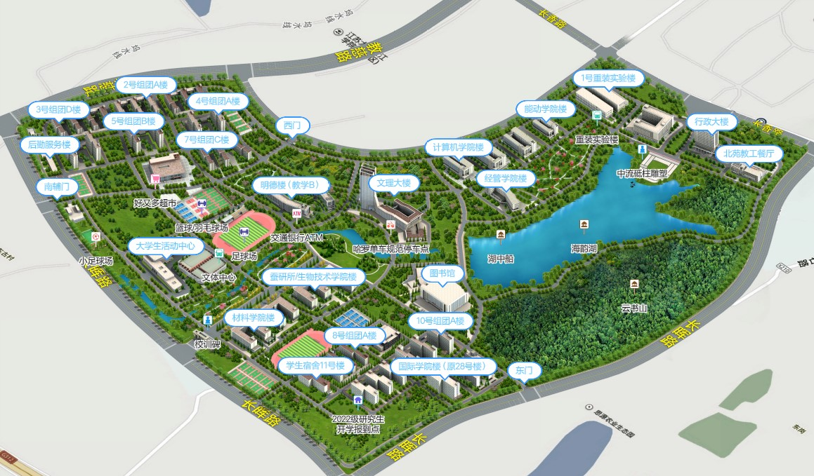

# 中国大学生计算机设计大赛省级赛事管理系统 
【任务描述】 
设计一款赛事管理系统，实现赛务相关的数据管理及信息服务，该系统能够为省级赛事管理解决以下问题： 
（1）赛事信息管理：从team.txt中读取参赛队伍的基本信息，设计合适的数据结构存储，能实现对参赛队伍的增加、修改和浏览。为参赛队伍分配一个分数为60\~100之间的初赛成绩，并能实现参赛队伍的成绩查询（实现基于二叉排序树的查找）。设计合适的输入输出，根据提示输入参赛队编号，查询队伍的初赛成绩，若查找成功，输出该赛事类别对应的基本信息（参赛作品名称、参赛学校、赛事类别、参赛者和初赛成绩信息）。另外，输出全部参赛队的平均查找长度ASL。 
（2）决赛现场模拟：首先进行决赛分组，生成决赛秩序册，供参赛队查询。根据赛事类别将参赛队伍分配到17个决赛室（编号为1~17）。秩序册中每个决赛室的进场顺序为初赛成绩降序排列。（排序算法从选择排序、插入排序、希尔排序、归并排序、堆排序中选择一种，并为选择该算法的原因做出说明）然后，模拟决赛秩序。比赛现场会设置大型候赛区，场地中有大屏以时间线动态展示各决赛室中正在决赛的队伍，侯赛的队伍及比赛结束的队伍信息。请编写程序模拟候赛区大屏上动态展示各参赛队候场、比赛中、比赛结束的状态。 
（3）决赛地图导览：为参赛者提供决赛主办地的各种路径导航的查询服务，以我校长山校区提供比赛场地为例，为参赛者提供不少于12个目标地的导航。为参赛者提供校园地图中任意目标地（建筑物）相关信息的查询；提供图中任意目标地（建筑物）的问路查询。 
【任务要求】 
1）请根据任务描述的问题，设计合理的菜单，菜单交互设计要合理，便于用户根据提示使用系统的所有功能。 
2）赛事数据要求从文件（txt或excel）读入，修改后的信息能存入文件。 
3）第三个任务赛地目的地查询，需输出目的地（建筑物）名称、代号、简介等信息；最短路径的输出需包含途经地及最短路径值；并分析主要算法的时间复杂度。 
4）请自行设计测试数据。使用全部合法数据，整体非法数据，局部非法数据对程序测试，以保证程序的健壮性。 
5）编码时请注意规范代码结构，重要的变量，函数要有清晰的注释；注重代码的效率和可重用性，实现低耦合、高内聚，不要将各种功能混在一个方法中编写。 
【实现步骤提示】 
  1）分析任务，进行功能设计，菜单设计； 
2）定义数据结构，建议按照抽象数据类型的定义、表示和实现来描述，用类C语言（伪代码）来描述数据的存储表示和相应操作的具体实现过程。 
3）设计合适的算法来实现其功能，并绘制函数调用关系图 

